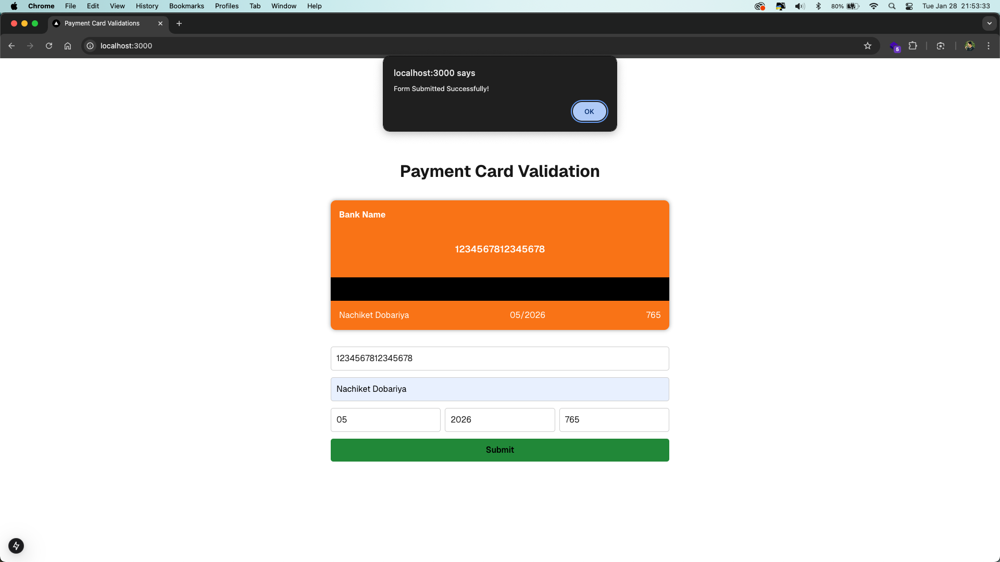

# 🏦 Payment Card Validation Application

This project is a **Payment Card Validation** web application built using **Next.js** and deployed on **Vercel**. The app provides an interactive interface for users to validate payment card details, including card number, cardholder name, expiration month and year, and CVV.

## ✨ Features

- ✅ **Real-time Validation**: Provides instant feedback for invalid inputs (e.g., invalid card number, invalid CVV).  
- 🎴 **Dynamic Card Display**: Updates the card preview dynamically based on user input.  
- ♿ **Accessibility**: Implements accessible error messages for each input field.  
- 📱 **Responsive Design**: Optimized for all devices, including mobile and desktop.  
- 🚀 **Smooth Deployment**: Hosted on **Vercel** for seamless accessibility.  

## 💻 Technologies Used

- ⚛️ **Next.js**: Framework for building React applications with server-side rendering.  
- 🖼️ **React.js**: UI library for building interactive user interfaces.  
- 🎨 **Tailwind CSS**: Styling the application.  
- 🌍 **Vercel**: Deployment platform for hosting Next.js applications.

## 🌐 Project Demo 🚀

You can access the live application here: https://payment-card-validation.vercel.app

## 🛠️ Setup & Installation

Follow the steps below to run the project locally:

1. Clone this repository:
   ```bash
   git clone https://github.com/nachiketdobariya/PaymentValidation.git
   ```

2. Navigate to the project directory:
   ```bash
   cd PaymentValidation
   ```

3. Install dependencies:
   ```bash
   yarn install
   ```

4. Run the development server:
   ```bash
   yarn dev
   ```

5. Open the app in your browser at `http://localhost:3000` or `http://10.0.0.20:3000`


## 📝 Validations

The application performs the following validations:

1. **Card Number**:  
   - 🔢 Must be exactly 16 digits.  
   - ❌ Displays an error if invalid: `Invalid Card Number`.  

2. **Cardholder Name**:  
   - 🧑‍💻 Must contain only English letters.  
   - ❌ Displays an error if invalid: `Invalid Card Name`.  

3. **Expiration Month**:  
   - 📅 Must be a two-digit number (01–12).  
   - ❌ Displays an error if invalid: `Invalid Month`.  

4. **Expiration Year**:  
   - 📅 Must be a four-digit number between the current year and up to 3 years in the future.  
   - ❌ Displays an error if invalid: `Invalid Year`.  

5. **CVV**:  
   - 🔐 Must be exactly 3 digits.  
   - ❌ Displays an error if invalid: `Invalid CVV`.  

## 📸 Screenshots

### Initial Validation  
<div style="display: flex; overflow-x: auto; white-space: nowrap; gap: 10">
  
</div>

### Successful Form Submission  
<div style="display: flex; overflow-x: auto; white-space: nowrap; gap: 10">
  
</div>

---

Feel free to modify this as required! 😊
